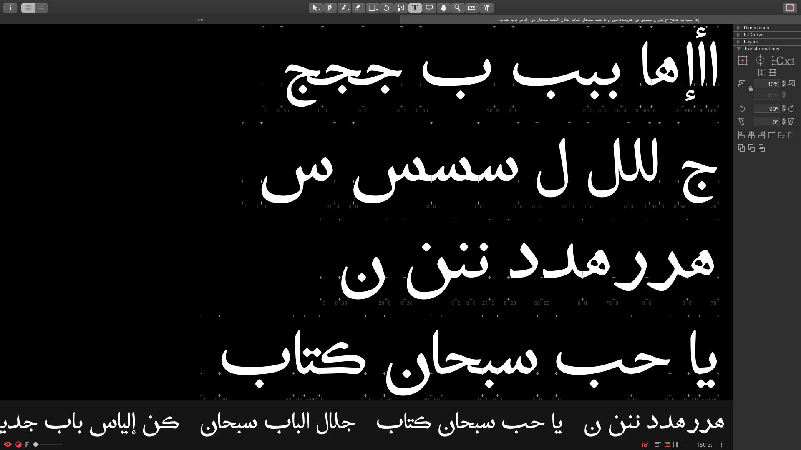
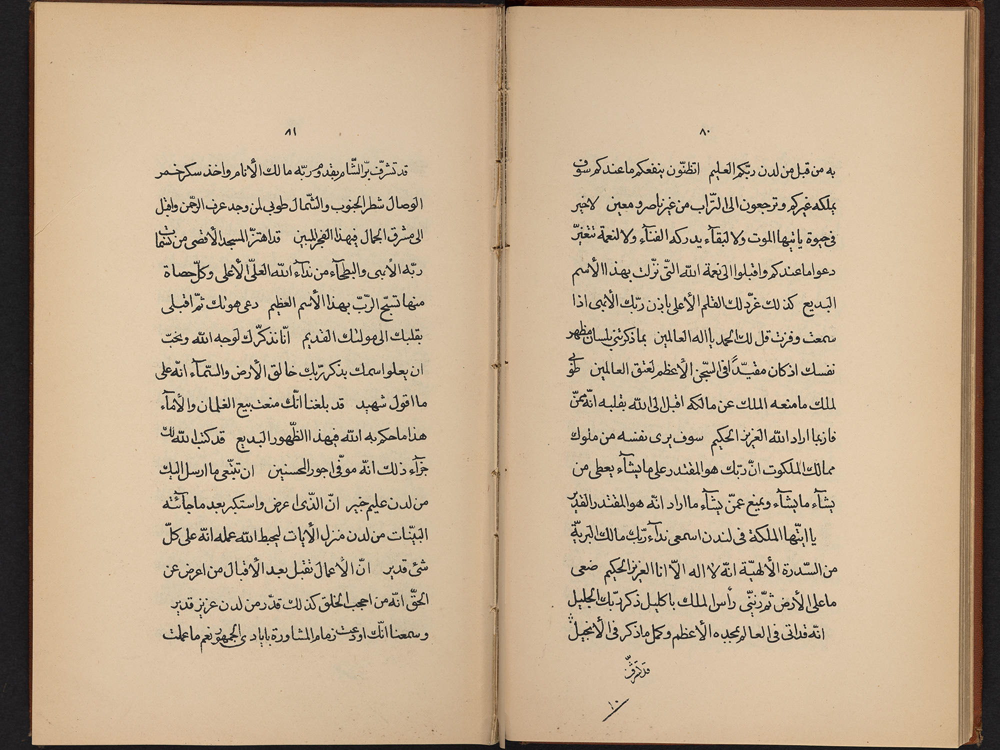
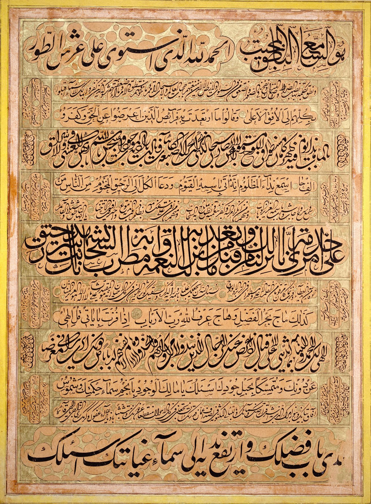
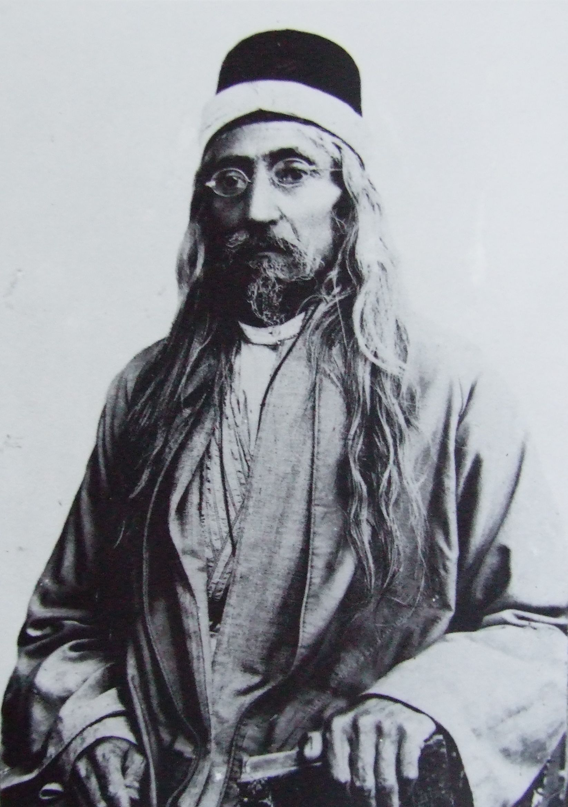

# Open Gate Naskh
⚠️

Note: This typeface is a work in progress, and made by a type designer with questionable skill, education, taste, and background for a project like this. Please think of it as an educational exercise at this point, and not a easy-to-use comercial product. Pull requests are always welcome, and leave an issue if you have any question.

-Eli H

Open Gate Naskh is a typeface for the Perso-Arabic script in a persian-naskh-like style.

## Development
For instructions on how to work with the source files and how to
[compile & build font files](CONTRIBUTING.md#compiling-font-files),
refer to [CONTRIBUTING.md](CONTRIBUTING.md).

Open Gate Naskh is licensed under the [SIL Open Font License](OFL.txt)

## Refrence

Refrence Video 1: Borna Izadpanah - The emergence of printing in Qajar Iran
| Borna Izadpanah - The emergence of printing in Qajar Iran | Source: https://www.youtube.com/watch?v=n67bRO3PYBs |
| - | - |

Refrence Image 1: A printed book lithographed probably in Bombay in 1893 from the handwriting of calligrapher Mírzá Ḥusayn-i-Isfahání; 1826 – 1912, (surnamed [Mis͟hkín-Qalam](https://en.wikipedia.org/wiki/Mishk%C3%ADn-Qalam) (مشكین قلم).

| Source: [British Library](https://www.bl.uk/collection-items/bahaullahs-letter-to-queen-victoria) | Permission: Public Domain | Published: 1893, Bombay, now Mumbai |
| --- | --- | --- |

Refrence Image 2: Calligraphy by Mis͟hkín-Qalam. House of Abbud, Central Hall, Akka.
| Source: [Wikimedia Commons](https://commons.wikimedia.org/wiki/File:Mishkin-Qalam-23.JPG) | Permission: Public Domain | Origin: Society for Persian Letters & Arts |
| --- | --- | --- |

Refrence Image 3: Photograph of Mishkín-Qalam (1826-1912)
| Source: [Wikimedia Commons](https://commons.wikimedia.org/wiki/File:Mishkin-Qalam-1.JPG) | Permission: Public Domain | Origin: Society for Persian Letters & Arts |
| --- | --- | --- |

